# UniClubs – Comprehensive Use Case Diagram

This document provides a complete use case analysis of the UniClubs platform, including all actors, use cases, and their relationships. It is followed by a PlantUML script that can be rendered into a graphical use case diagram, broken down by functional modules for clarity.

---

## 1. Actors

### Primary Actors (Human)

| Actor                           | Description                                                                                                     |
| ------------------------------- | --------------------------------------------------------------------------------------------------------------- |
| **Student**                     | Any authenticated university member. Can browse, join clubs, and discover events.                               |
| **Club Member**                 | A student who is a member of at least one club. Inherits all Student capabilities and gains member-only access. |
| **Club Officer**                | A club member holding an officer role. Generalization of all specific officer roles.                            |
| **President**                   | Full admin control over club. Can manage all settings, roles, and data.                                         |
| **Vice President**              | Similar to President with minor restrictions; can moderate content.                                             |
| **Secretary**                   | Manages roster, minutes, attendance reports.                                                                    |
| **Treasurer**                   | Manages club finances, budget, and expenses.                                                                    |
| **Event Coordinator**           | Creates, edits events; manages RSVPs and check‑in.                                                              |
| **Public Relations Officer**    | Creates public posts, showcases projects, manages external inquiries.                                           |
| **Content Moderator**           | Reviews flagged content and enforces community guidelines.                                                      |
| **University Admin**            | Generalization for all university staff accounts.                                                               |
| **Club Affairs Officer**        | Views all clubs, activity reports, membership stats; handles registration approvals.                            |
| **Compliance & Safety Officer** | Monitors flagged content, disciplinary logs, and can suspend clubs/members.                                     |
| **Super Admin (IT)**            | System configuration, data retention, feature flags.                                                            |
| **Faculty Advisor** (optional)  | May receive reports or approve budget requests (limited role).                                                  |

### Supporting Actors (External Systems)

| Actor                        | Description                                                                |
| ---------------------------- | -------------------------------------------------------------------------- |
| **Authentication Service**   | Provides local credential authentication and basic account attributes.     |
| **Email System**             | Sends email notifications for the platform.                                |
| **Calendar System**          | External calendar applications (Google, Outlook) that receive event feeds. |
| **AI Moderation Engine**     | Scans content for policy violations in real time.                          |
| **AI Recommendation Engine** | Generates personalized club suggestions.                                   |
| **AI Report Generator**      | Compiles narrative activity/summary reports.                               |
| **Payment Gateway**          | Handles online payments for club dues/event fees (optional).               |
| **LMS (Canvas/Moodle)**      | Links academic clubs to courses (optional integration).                    |

### Actor Generalizations

- **Club Member** inherits from **Student**.
- **Club Officer** inherits from **Club Member**.
- Specific officer roles (President, VP, Secretary, etc.) inherit from **Club Officer**.
- **University Admin** sub‑types inherit from **University Admin**.

---

## 2. Use Case Packages (Modules)

The system is divided into functional packages. Each package contains a set of use cases with include/extend relationships.

### 2.1 Club Management

- **Review Club Registration Request** (University Admin) – handles requests created through the admin intake workflow, including _Approve_, _Reject_, and _Request Additional Info_.
- **Approve/Reject Club Registration** (University Admin)
- **Manage Club Profile** (Club Officer) – includes _Update Club Info_, _Set Membership Policy_, _Manage Tags & Categories_, _Upload Media Gallery_.
- **Suspend/Reactivate Club** (University Admin)
- **View Club Profile** (Student, Club Member)

### 2.2 Membership & Roles

- **Request Membership** (Student)
- **Approve/Deny Membership** (Club Officer)
- **Invite Member** (Club Officer) – for invite-only clubs
- **Leave Club** (Club Member)
- **Assign Role** (President, VP)
- **Remove Member** (Club Officer)
- **View Membership Roster** (Club Officer) – includes _Export Roster_
- **Manage Officer Permissions** (President) – extends _Assign Role_ when creating custom roles

### 2.3 Project & Portfolio

- **Create Project** (Club Officer) – includes _Upload Images/Files_, _Tag Members_
- **Edit/Delete Project** (Club Officer)
- **View Public Projects** (Student, Club Member)
- **Like/Comment on Project** (Student, Club Member)

### 2.4 Events & RSVP

- **Create Event** (Event Coordinator) – includes _Set Location/Time_, _Customize RSVP Form_, _Set Capacity & Waitlist_, _Choose Visibility_, _Add Cover Image_.
- **Edit/Duplicate Event** (Event Coordinator)
- **Cancel Event** (Event Coordinator)
- **View Event Details** (Student, Club Member)
- **RSVP to Event** (Student) – includes _Fill RSVP Form_; extends to _Join Waitlist_ (if full), _Receive Confirmation_.
- **Cancel RSVP** (Student) – extends _RSVP to Event_
- **Check-in Attendee** (Event Coordinator) – implemented via extension points: _Manual Check-in_, _QR Code Scan_, _Geolocation_, _Self Check-in_.
- **View Attendance Report** (Secretary, Event Coordinator) – includes _Export Attendance_.

### 2.5 Communication & Content

- **Create Post** (PR Officer, Club Officer) – extends: _Schedule Post_, _Create Poll_, _Embed Event/Project_.
- **Comment on Post** (Student, Club Member)
- **Report Post/Comment** (Student, Club Member)
- **AI Content Scan** (performed by AI Moderation Engine) – triggered automatically when _Create Post_ or _Comment_ occurs. Includes _Block Violation_, _Flag for Review_, _Notify Moderator_, and keeping content in an _Under Review_ state until approval.
- **Review Flagged Content** (Content Moderator) – includes _Approve_, _Reject_, _Ban User_.
- **Submit Appeal** (Content Author) – extends _Review Flagged Content_ after rejection.
- **Manage Club Contact Information** (PR Officer)

### 2.6 Notifications

- **Configure Notification Preferences** (All Users)
- **Receive In‑App Notification** (All Users)
- **Receive Email Digest** (All Users) – triggered by Email System
- **Send Club Announcement** (Secretary, President) – sends to members
- **Send University‑Wide Message** (University Admin)

### 2.7 Student Discovery & Dashboard

- **View Personalized Dashboard** (Student)
- **Discover & Search Clubs** (Student) – includes _Filter/Sort_, _Compare Clubs_.
- **Get AI Club Recommendations** (Student) – uses AI Recommendation Engine
- **View My Upcoming Events** (Student)
- **Manage Student Profile** (Student) – includes _Set Interests for AI_, _Privacy Settings_.
- **Add Event to Personal Calendar** (Student) – interacts with Calendar System

### 2.8 University Oversight & Analytics

- **View Global Admin Dashboard** (University Admin)
- **Monitor All Clubs** (Club Affairs Officer) – includes _View Club Details_, _Review Membership Stats_.
- **Manage Registration Requests** (Club Affairs Officer) – includes _Request Additional Info_, _Approve_, _Reject_.
- **Manage Moderation Queue** (Compliance & Safety Officer) – includes _View AI Logs_, _Resolve Escalations_, _Suspend Club/Member_.
- **Generate University‑Level Reports** (University Admin) – includes: _Club Health Report_, _Engagement Report_, _Diversity & Inclusion Report_, _Compliance Report_.
- **AI‑Generated Executive Summary** (AI Report Generator) – extends _Generate University‑Level Reports_.

### 2.9 Club‑Level Analytics & AI

- **View Club Analytics Dashboard** (Club Officer) – includes _Membership Trends_, _Event Stats_, _Engagement Metrics_.
- **Generate Club Activity Report** (President, Secretary) – includes _Export Report_; extended by _AI Summary Generation_ (from AI Report Generator).
- **AI‑Powered Sentiment Analysis** (AI Report Generator) – extends _Create Survey_ (if used for survey responses).

### 2.10 Financial Management (optional module)

- **Manage Club Budget** (Treasurer) – includes _Record Income/Expense_, _Upload Receipt_.
- **Approve Large Expense** (President, Faculty Advisor)
- **View Financial Reports** (Treasurer, President)
- **Process Online Payment** (Payment Gateway) – used when _Pay Dues_ or _Pay Event Fee_.

### 2.11 Gamification & Engagement

- **Earn Achievement Badge** (System‑triggered, viewed by Student/Club)
- **View Leaderboard** (Student, Club Officer)
- **Share Achievement** (Student)

### 2.12 System & Integration

- **Authenticate via email or student ID/password** (Student, University Staff) – mandatory prerequisite for all use cases.
- **Sync Calendar Feed** (External Calendar System)
- **Connect LMS Course** (Club Officer utilizing LMS integration)

---

## 3. Key Relationships Highlighted

- **Generalization:** Student → Club Member → Club Officer → [specific roles]. University Admin → [specialized admins].
- **Includes:** _Create Event_ includes _Set Capacity & Waitlist_, _RSVP to Event_ includes _Fill RSVP Form_.
- **Extends:** _Track Attendance_ has extension points for different check‑in methods. _Generate Club Activity Report_ extends with _AI Summary Generation_.
- **Actor Interactions:** AI Moderation Engine is triggered by _Create Post_ and _Comment_. AI Recommendation Engine is used during _Get AI Club Recommendations_. Email System sends notifications after many use cases.

---

## 4. PlantUML Code for the Complete Use Case Diagram

Below is a PlantUML script that models all actors and use cases organized into packages. You can paste it into any PlantUML viewer to generate the diagram.

```plantuml
@startuml UniClubs_UseCase_Diagram
!define RECTANGLE package
left to right direction
skinparam packageStyle rect
skinparam actorStyle awesome

' ====== ACTORS ======
actor "Student" as Student
actor "Club Member" as ClubMember
actor "Club Officer" as ClubOfficer
actor "President" as President
actor "Vice President" as VP
actor "Secretary" as Secretary
actor "Treasurer" as Treasurer
actor "Event Coordinator" as EventCoord
actor "Public Relations Officer" as PROfficer
actor "Content Moderator" as ContentMod
actor "University Admin" as UnivAdmin
actor "Club Affairs Officer" as ClubAffairs
actor "Compliance & Safety Officer" as ComplSafety
actor "Super Admin (IT)" as SuperAdmin
actor "Faculty Advisor" as Faculty

' External Systems
actor "Authentication Service" as AuthService
actor "Email System" as Email
actor "Calendar System" as Calendar
actor "AI Moderation Engine" as AIMod
actor "AI Recommendation Engine" as AIRec
actor "AI Report Generator" as AIReport
actor "Payment Gateway" as Payment
actor "LMS" as LMS

' ====== GENERALIZATIONS ======
ClubMember --|> Student
ClubOfficer --|> ClubMember
President --|> ClubOfficer
VP --|> ClubOfficer
Secretary --|> ClubOfficer
Treasurer --|> ClubOfficer
EventCoord --|> ClubOfficer
PROfficer --|> ClubOfficer
ContentMod --|> ClubOfficer

ClubAffairs --|> UnivAdmin
ComplSafety --|> UnivAdmin
SuperAdmin --|> UnivAdmin

' ====== PACKAGES ======
package "Club Management" {
  usecase "Register Club" as UC_RegClub
  usecase "Approve/Reject Registration" as UC_ApproveReg
  usecase "Suspend/Reactivate Club" as UC_Suspend
  usecase "Manage Club Profile" as UC_ManageProfile
  usecase "View Club Profile" as UC_ViewProfile
  usecase "Upload Constitution" as UC_UploadConst
  usecase "Invite Founding Members" as UC_InviteFounders
  usecase "Update Club Info" as UC_UpdateInfo
  usecase "Set Membership Policy" as UC_SetPolicy
  usecase "Manage Tags & Categories" as UC_Tags
  usecase "Upload Media Gallery" as UC_Media
}

package "Membership & Roles" {
  usecase "Request Membership" as UC_ReqMembership
  usecase "Approve/Deny Membership" as UC_ApproveMem
  usecase "Invite Member" as UC_InviteMember
  usecase "Leave Club" as UC_LeaveClub
  usecase "Assign Role" as UC_AssignRole
  usecase "Remove Member" as UC_RemoveMember
  usecase "View Membership Roster" as UC_ViewRoster
  usecase "Export Roster" as UC_ExportRoster
  usecase "Manage Officer Permissions" as UC_Permissions
}

package "Project & Portfolio" {
  usecase "Create Project" as UC_CreateProject
  usecase "Upload Images/Files" as UC_ProjUpload
  usecase "Tag Members" as UC_TagMembers
  usecase "Edit/Delete Project" as UC_EditProj
  usecase "View Public Projects" as UC_ViewProj
  usecase "Like/Comment on Project" as UC_InteractProj
}

package "Events & RSVP" {
  usecase "Create Event" as UC_CreateEvent
  usecase "Set Location/Time" as UC_SetLocTime
  usecase "Customize RSVP Form" as UC_CustomRSVP
  usecase "Set Capacity & Waitlist" as UC_Capacity
  usecase "Choose Visibility" as UC_Visibility
  usecase "Edit/Duplicate Event" as UC_EditEvent
  usecase "Cancel Event" as UC_CancelEvent
  usecase "View Event Details" as UC_ViewEvent
  usecase "RSVP to Event" as UC_RSVP
  usecase "Fill RSVP Form" as UC_FillRSVP
  usecase "Join Waitlist" as UC_JoinWaitlist
  usecase "Receive Confirmation" as UC_ConfirmRSVP
  usecase "Cancel RSVP" as UC_CancelRSVP
  usecase "Track Attendance" as UC_TrackAtt
  usecase "Manual Check-in" as UC_ManualCheck
  usecase "QR Code Scan" as UC_QRScan
  usecase "Geolocation Check-in" as UC_GeoCheck
  usecase "Self Check-in" as UC_SelfCheck
  usecase "View Attendance Report" as UC_AttReport
  usecase "Export Attendance" as UC_ExportAtt
}

package "Communication & Content" {
  usecase "Create Post" as UC_CreatePost
  usecase "Schedule Post" as UC_SchedPost
  usecase "Create Poll" as UC_CreatePoll
  usecase "Embed Event/Project" as UC_Embed
  usecase "Comment on Post" as UC_Comment
  usecase "Report Post/Comment" as UC_ReportContent
  usecase "AI Content Scan" as UC_AIScan
  usecase "Block Violation" as UC_BlockViolation
  usecase "Flag for Review" as UC_FlagReview
  usecase "Notify Moderator" as UC_NotifyMod
  usecase "Review Flagged Content" as UC_ReviewFlag
  usecase "Approve Content" as UC_ApproveContent
  usecase "Reject Content" as UC_RejectContent
  usecase "Ban User" as UC_BanUser
  usecase "Submit Appeal" as UC_Appeal
}

package "Notifications & Messaging" {
  usecase "Configure Notification Preferences" as UC_NotifPref
  usecase "Receive In-App Notification" as UC_InAppNotif
  usecase "Receive Email Digest" as UC_EmailDigest
  usecase "Send Club Announcement" as UC_ClubAnnounce
  usecase "Send University-Wide Message" as UC_UniMsg
}

package "Student Discovery & Dashboard" {
  usecase "View Personalized Dashboard" as UC_Dashboard
  usecase "Discover & Search Clubs" as UC_Discover
  usecase "Filter/Sort Clubs" as UC_FilterClub
  usecase "Compare Clubs" as UC_CompareClub
  usecase "Get AI Club Recommendations" as UC_AIRecommend
  usecase "Manage Student Profile" as UC_StudentProfile
  usecase "Set Interests for AI" as UC_SetInterests
  usecase "View My Upcoming Events" as UC_MyEvents
  usecase "Add Event to Personal Calendar" as UC_AddCalendar
}

package "University Oversight & Analytics" {
  usecase "View Global Admin Dashboard" as UC_AdminDashboard
  usecase "Monitor All Clubs" as UC_Monitor
  usecase "Manage Registration Requests" as UC_ManageRegReq
  usecase "Request Additional Info" as UC_ReqInfo
  usecase "Manage Moderation Queue" as UC_ModQueue
  usecase "Resolve Escalations" as UC_ResolveEscalation
  usecase "Suspend Club/Member" as UC_SuspendClubMem
  usecase "Generate University-Level Reports" as UC_GenUniReport
  usecase "Club Health Report" as UC_HealthReport
  usecase "Engagement Report" as UC_EngageReport
  usecase "Diversity & Inclusion Report" as UC_DIReport
  usecase "Compliance Report" as UC_ComplianceReport
  usecase "AI Executive Summary" as UC_AIExecSummary
}

package "Club-Level Analytics & AI" {
  usecase "View Club Analytics Dashboard" as UC_ClubAnalytics
  usecase "Generate Club Activity Report" as UC_ClubActReport
  usecase "Export Report" as UC_ExportReport
  usecase "AI Summary Generation" as UC_AISummary
  usecase "Create Survey" as UC_CreateSurvey
  usecase "AI Sentiment Analysis" as UC_AISentiment
}

package "Financial Management (Optional)" {
  usecase "Manage Club Budget" as UC_MngBudget
  usecase "Record Income/Expense" as UC_RecordTrans
  usecase "Upload Receipt" as UC_UploadReceipt
  usecase "Approve Large Expense" as UC_ApproveExpense
  usecase "View Financial Reports" as UC_ViewFinReport
  usecase "Process Online Payment" as UC_Payment
}

package "Gamification & Engagement" {
  usecase "Earn Achievement Badge" as UC_EarnBadge
  usecase "View Leaderboard" as UC_Leaderboard
  usecase "Share Achievement" as UC_ShareBadge
}

package "System & Integration" {
  usecase "Authenticate via email or student ID/password" as UC_Login
  usecase "Sync Calendar Feed" as UC_CalSync
  usecase "Connect LMS Course" as UC_LMSConnect
}

' ====== RELATIONSHIPS ======
' --- Club Management ---
UnivAdmin --> UC_RegClub
UC_RegClub ..> UC_UploadConst : <<extend>>
UC_RegClub ..> UC_InviteFounders : <<extend>>
UnivAdmin --> UC_ApproveReg
UnivAdmin --> UC_Suspend
ClubOfficer --> UC_ManageProfile
UC_ManageProfile ..> UC_UpdateInfo : <<include>>
UC_ManageProfile ..> UC_SetPolicy : <<include>>
UC_ManageProfile ..> UC_Tags : <<include>>
UC_ManageProfile ..> UC_Media : <<include>>
Student --> UC_ViewProfile
ClubMember --> UC_ViewProfile

' --- Membership ---
Student --> UC_ReqMembership
ClubOfficer --> UC_ApproveMem
ClubOfficer --> UC_InviteMember
ClubMember --> UC_LeaveClub
President --> UC_AssignRole
UC_AssignRole ..> UC_Permissions : <<extend>> (custom role)
ClubOfficer --> UC_RemoveMember
ClubOfficer --> UC_ViewRoster
UC_ViewRoster ..> UC_ExportRoster : <<include>>

' --- Project ---
PROfficer --> UC_CreateProject
UC_CreateProject ..> UC_ProjUpload : <<include>>
UC_CreateProject ..> UC_TagMembers : <<include>>
PROfficer --> UC_EditProj
Student --> UC_ViewProj
ClubMember --> UC_ViewProj
Student --> UC_InteractProj
ClubMember --> UC_InteractProj

' --- Events ---
EventCoord --> UC_CreateEvent
UC_CreateEvent ..> UC_SetLocTime : <<include>>
UC_CreateEvent ..> UC_CustomRSVP : <<include>>
UC_CreateEvent ..> UC_Capacity : <<include>>
UC_CreateEvent ..> UC_Visibility : <<include>>
EventCoord --> UC_EditEvent
EventCoord --> UC_CancelEvent
Student --> UC_ViewEvent
ClubMember --> UC_ViewEvent
Student --> UC_RSVP
UC_RSVP ..> UC_FillRSVP : <<include>>
UC_RSVP ..> UC_JoinWaitlist : <<extend>>
UC_RSVP ..> UC_ConfirmRSVP : <<include>>
Student --> UC_CancelRSVP
EventCoord --> UC_TrackAtt
UC_TrackAtt ..> UC_ManualCheck : <<extend>>
UC_TrackAtt ..> UC_QRScan : <<extend>>
UC_TrackAtt ..> UC_GeoCheck : <<extend>>
UC_TrackAtt ..> UC_SelfCheck : <<extend>>
Secretary --> UC_AttReport
EventCoord --> UC_AttReport
UC_AttReport ..> UC_ExportAtt : <<include>>

' --- Content ---
PROfficer --> UC_CreatePost
ClubOfficer --> UC_CreatePost
UC_CreatePost ..> UC_SchedPost : <<extend>>
UC_CreatePost ..> UC_CreatePoll : <<extend>>
UC_CreatePost ..> UC_Embed : <<extend>>
Student --> UC_Comment
ClubMember --> UC_Comment
Student --> UC_ReportContent
ClubMember --> UC_ReportContent
' AI Moderation triggered by post/comment
UC_CreatePost ..> UC_AIScan : <<include>>
UC_Comment ..> UC_AIScan : <<include>>
AIMod --> UC_AIScan
UC_AIScan ..> UC_BlockViolation : <<extend>>
UC_AIScan ..> UC_FlagReview : <<extend>>
UC_FlagReview ..> UC_NotifyMod : <<include>>
ContentMod --> UC_ReviewFlag
UC_ReviewFlag ..> UC_ApproveContent : <<extend>>
UC_ReviewFlag ..> UC_RejectContent : <<extend>>
UC_ReviewFlag ..> UC_BanUser : <<extend>>
' Appeal
Student --> UC_Appeal
ClubMember --> UC_Appeal
UC_Appeal ..> UC_ReviewFlag : <<extend>>

' --- Notifications ---
Student --> UC_NotifPref
ClubMember --> UC_NotifPref
ClubOfficer --> UC_NotifPref
UnivAdmin --> UC_NotifPref
Student --> UC_InAppNotif
ClubMember --> UC_InAppNotif
ClubOfficer --> UC_InAppNotif
UnivAdmin --> UC_InAppNotif
Email --> UC_EmailDigest
Secretary --> UC_ClubAnnounce
President --> UC_ClubAnnounce
UnivAdmin --> UC_UniMsg

' --- Discovery ---
Student --> UC_Dashboard
Student --> UC_Discover
UC_Discover ..> UC_FilterClub : <<include>>
UC_Discover ..> UC_CompareClub : <<extend>>
Student --> UC_AIRecommend
AIRec --> UC_AIRecommend
Student --> UC_StudentProfile
UC_StudentProfile ..> UC_SetInterests : <<include>>
Student --> UC_MyEvents
Student --> UC_AddCalendar
Calendar --> UC_AddCalendar

' --- University Oversight ---
UnivAdmin --> UC_AdminDashboard
ClubAffairs --> UC_Monitor
ClubAffairs --> UC_ManageRegReq
UC_ManageRegReq ..> UC_ReqInfo : <<extend>>
ComplSafety --> UC_ModQueue
UC_ModQueue ..> UC_ResolveEscalation : <<extend>>
UC_ModQueue ..> UC_SuspendClubMem : <<extend>>
UnivAdmin --> UC_GenUniReport
UC_GenUniReport ..> UC_HealthReport : <<include>>
UC_GenUniReport ..> UC_EngageReport : <<include>>
UC_GenUniReport ..> UC_DIReport : <<include>>
UC_GenUniReport ..> UC_ComplianceReport : <<include>>
UC_GenUniReport ..> UC_AIExecSummary : <<extend>>
AIReport --> UC_AIExecSummary

' --- Club Analytics ---
President --> UC_ClubAnalytics
Secretary --> UC_ClubAnalytics
President --> UC_ClubActReport
Secretary --> UC_ClubActReport
UC_ClubActReport ..> UC_ExportReport : <<include>>
UC_ClubActReport ..> UC_AISummary : <<extend>>
AIReport --> UC_AISummary
' Survey creation by any officer
ClubOfficer --> UC_CreateSurvey
UC_CreateSurvey ..> UC_AISentiment : <<extend>>
AIReport --> UC_AISentiment

' --- Finance ---
Treasurer --> UC_MngBudget
UC_MngBudget ..> UC_RecordTrans : <<include>>
UC_MngBudget ..> UC_UploadReceipt : <<include>>
President --> UC_ApproveExpense
Faculty --> UC_ApproveExpense
Treasurer --> UC_ViewFinReport
President --> UC_ViewFinReport
Student --> UC_Payment
Payment --> UC_Payment

' --- Gamification ---
Student --> UC_EarnBadge
ClubMember --> UC_EarnBadge
Student --> UC_Leaderboard
ClubMember --> UC_Leaderboard
Student --> UC_ShareBadge

' --- System ---
Student --> UC_Login
ClubMember --> UC_Login
ClubOfficer --> UC_Login
UnivAdmin --> UC_Login
AuthService --> UC_Login
Calendar --> UC_CalSync
ClubOfficer --> UC_LMSConnect
LMS --> UC_LMSConnect

@enduml
```

---

This use case diagram covers the complete functional scope of UniClubs, with all actors, inheritance, inclusion, extension, and external system interactions. You can copy the PlantUML code into any compatible editor (http://plantuml.com/plantuml) to generate an interactive, searchable diagram.
